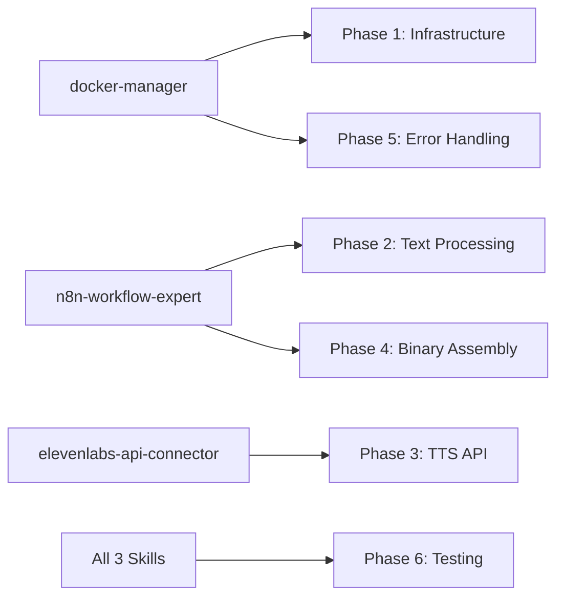
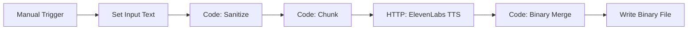
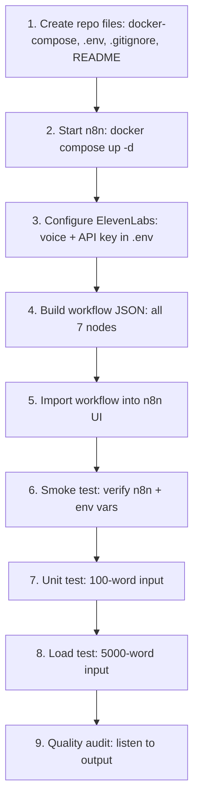

# Long-Form Meditation TTS -- Full Implementation Plan

**Target file:** [.cursor/plans/0002_full_implementation_plan.md](.cursor/plans/0002_full_implementation_plan.md)

This plan operationalizes the architecture from [.cursor/plans/0001_pre_plan.md](.cursor/plans/0001_pre_plan.md) into concrete deliverables: files to create, commands to run, and verification steps to confirm each phase works before moving on.

---

## 0. Skill Inventory

Three agent skills provide the domain knowledge required to execute this plan. Each skill maps to specific phases and must be read before entering its corresponding phase.


| Skill                      | Path                                                 | Covers                                                                                                                                               | Plan Phases                                          |
| -------------------------- | ---------------------------------------------------- | ---------------------------------------------------------------------------------------------------------------------------------------------------- | ---------------------------------------------------- |
| `docker-manager`           | `~/.cursor/skills/docker-manager/SKILL.md`           | Docker Compose lifecycle, container health, logs, volumes, port conflicts, cleanup                                                                   | Phase 1 (Infrastructure)                             |
| `n8n-workflow-expert`      | `~/.cursor/skills/n8n-workflow-expert/SKILL.md`      | Workflow JSON architecture, Code node JS, n8n expressions, text sanitization, sentence-aware chunking, binary merge via n8n helpers, execution modes | Phase 2 (Text Processing), Phase 4 (Binary Assembly) |
| `elevenlabs-api-connector` | `~/.cursor/skills/elevenlabs-api-connector/SKILL.md` | TTS endpoint schema, auth headers, voice settings tuning, model selection, rate limit handling, error codes, voice creation workflow                 | Phase 3 (TTS Orchestration)                          |


### Skill-to-Phase Mapping




### Activation Protocol

Before beginning any phase, the agent must:

1. Read the *corresponding s*kill file(s) from the table above.
2. Apply the skill's rules and patterns during execution.
3. Reference the skill's troubleshooting section if errors occur.

---

## 1. Repository Bootstrap

The workspace is currently empty (no app code, no Docker files, no env). We need foundational files.

**Files to create:**

- `docker-compose.yml` -- n8n service definition (preferred over raw `docker run` for reproducibility)
- `.env.example` -- template listing required secrets (never commit real values)
- `.env` -- actual secrets (added to `.gitignore`)
- `.gitignore` -- ignore `.env`, `node_modules`, `.n8n/` data dir, `.DS_Store`
- `README.md` -- project overview, quickstart, architecture diagram
- `workflows/` directory -- for exported n8n workflow JSON

### 1.1 docker-compose.yml

Use Docker Compose instead of the raw `docker run` from the pre-plan for persistence, port mapping, env injection, and easy teardown.

```yaml
version: "3.8"
services:
  n8n:
    image: n8nio/n8n:latest
    container_name: n8n
    restart: always
    ports:
      - "5678:5678"
    environment:
      - N8N_LOG_LEVEL=info
      - N8N_METRICS=true
      - GENERIC_TIMEZONE=UTC
      - N8N_SECURE_COOKIE=false
    volumes:
      - n8n_data:/home/node/.n8n
    env_file:
      - .env

volumes:
  n8n_data:
```

Key decisions:

- Named volume `n8n_data` instead of bind-mount `~/.n8n` -- avoids permission issues across machines
- `env_file: .env` passes secrets (ElevenLabs key) into n8n
- `N8N_SECURE_COOKIE=false` for local dev (no HTTPS)

### 1.2 .env.example / .env

```
ELEVENLABS_API_KEY=your_api_key_here
ELEVENLABS_VOICE_ID=your_voice_id_here
```

### 1.3 .gitignore

```
.env
.n8n/
node_modules/
*.mp3
.DS_Store
```

### 1.4 README.md

Concise quickstart:

- Prerequisites (Docker, ElevenLabs account)
- Setup steps (`cp .env.example .env`, fill keys, `docker compose up -d`)
- Accessing n8n UI at `http://localhost:5678`
- Importing the workflow
- Architecture diagram (Mermaid)

---

## 2. ElevenLabs Voice Configuration

This is a manual step performed in the ElevenLabs web UI before workflow execution.

**Steps:**

1. Log in at [https://elevenlabs.io](https://elevenlabs.io)
2. Navigate to Voice Lab, create voice via Voice Design
3. Voice prompt: "Mature male, deep resonant tone, slow rhythmic delivery, authoritative and empathetic mentor style, clear and deliberate"
4. Copy the Voice ID from the voice card into `.env` as `ELEVENLABS_VOICE_ID`
5. Copy the API Key from Profile Settings into `.env` as `ELEVENLABS_API_KEY`

No automation needed -- document these steps in the README.

---

## 3. n8n Workflow Design (Importable JSON)

**File:** `workflows/meditation_tts.json`

This is the core deliverable: a complete n8n workflow JSON that can be imported via the n8n UI (Settings > Import from File).

### Workflow Node Graph




### 3.1 Node: Manual Trigger

- Type: `n8n-nodes-base.manualTrigger`
- Purpose: Kick off the workflow manually for testing; can be swapped for webhook/schedule later

### 3.2 Node: Set Input Text

- Type: `n8n-nodes-base.set`
- Purpose: Holds the meditation script text in a `text` field
- This is where users paste their meditation content
- Can be replaced with a webhook body, file read, or Google Sheets input later

### 3.3 Node: Sanitize Text (Code Node)

- Type: `n8n-nodes-base.code`
- Language: JavaScript
- Logic from pre-plan section 2.1: strip markdown bold, headings, emojis, normalize whitespace

```javascript
const text = $input.item.json.text || "";

function sanitize(input) {
  return input
    .replace(/\*\*/g, "")
    .replace(/#{1,6}\s?/g, "")
    .replace(/[\u{1F600}-\u{1F64F}\u{1F300}-\u{1F5FF}\u{1F680}-\u{1F6FF}]/gu, "")
    .replace(/\n\s*\n/g, "\n\n")
    .trim();
}

return { json: { clean_text: sanitize(text) } };
```

**Enhancement over pre-plan:** Also strip `_italic_`, `~~strikethrough~~`, and `[link](url)` markdown since meditation scripts may come from markdown editors.

### 3.4 Node: Sentence-Aware Chunking (Code Node)

- Type: `n8n-nodes-base.code`
- Language: JavaScript
- Logic from pre-plan section 2.2: split at sentence boundaries, max 2500 chars per chunk

```javascript
const fullText = $input.item.json.clean_text;
const MAX_CHARS = 2500;
const chunks = [];
let remainingText = fullText;

while (remainingText.length > 0) {
  if (remainingText.length <= MAX_CHARS) {
    chunks.push(remainingText);
    break;
  }
  let slice = remainingText.substring(0, MAX_CHARS);
  let lastIndex = Math.max(
    slice.lastIndexOf('. '),
    slice.lastIndexOf('? '),
    slice.lastIndexOf('! ')
  );
  if (lastIndex === -1) lastIndex = slice.lastIndexOf(' ');
  const finalSlice = remainingText.substring(0, lastIndex + 1).trim();
  chunks.push(finalSlice);
  remainingText = remainingText.substring(lastIndex + 1).trim();
}

return chunks.map((chunk, index) => ({
  json: { chunk_text: chunk, chunk_index: index, total_chunks: chunks.length }
}));
```

**Edge case handling (enhancement):** If `lastIndex` is still -1 (no spaces in 2500 chars -- unlikely for English prose), force-split at MAX_CHARS to prevent infinite loop.

### 3.5 Node: ElevenLabs TTS HTTP Request

- Type: `n8n-nodes-base.httpRequest`
- Method: POST
- URL: `https://api.elevenlabs.io/v1/text-to-speech/{{ $env.ELEVENLABS_VOICE_ID }}`
- Headers:
  - `xi-api-key`: `{{ $env.ELEVENLABS_API_KEY }}`
  - `Content-Type`: `application/json`
- Body (JSON):
  ```json
  {
    "text": "{{ $json.chunk_text }}",
    "model_id": "eleven_multilingual_v2",
    "voice_settings": {
      "stability": 0.65,
      "similarity_boost": 0.80
    }
  }
  ```
- Response Format: File (binary)
- Retry on Fail: enabled, 3 attempts, 5000ms interval
- Batch Size: 1 (sequential execution to respect rate limits)
- **Wait between batches:** 1000ms (rate limiting for Creator plan)

**Key detail:** The node reads env vars via `$env.ELEVENLABS_API_KEY` and `$env.ELEVENLABS_VOICE_ID`. These are injected into the n8n container from `.env` via `env_file` in docker-compose.

### 3.6 Node: Binary Merge (Code Node)

- Type: `n8n-nodes-base.code`
- Language: JavaScript
- Logic from pre-plan section 4.1: sort by chunk_index, concatenate binary buffers

```javascript
const items = $input.all();
if (items.length === 0) return [];

items.sort((a, b) => a.json.chunk_index - b.json.chunk_index);

const buffers = [];
for (let i = 0; i < items.length; i++) {
  const buffer = await this.helpers.getBinaryDataBuffer(i, 'data');
  buffers.push(buffer);
}

const mergedBuffer = Buffer.concat(buffers);

return {
  json: {
    fileName: "meditation_final.mp3",
    size_mb: (mergedBuffer.length / (1024 * 1024)).toFixed(2),
    chunks_merged: items.length
  },
  binary: {
    data: await this.helpers.prepareBinaryData(
      mergedBuffer,
      'meditation_final.mp3',
      'audio/mpeg'
    )
  }
};
```

**Important:** This node must be configured to wait for ALL items before executing (batch mode, not per-item). In the workflow JSON, set `executeOnce: true` or use a "Wait" / "Merge" node before it to collect all chunks.

### 3.7 Node: Write Binary File (Output)

- Type: `n8n-nodes-base.writeBinaryFile`
- File Name: `meditation_final.mp3`
- Property Name: `data`
- Purpose: Write the merged MP3 to the n8n container filesystem

Alternatively (or additionally): add a Google Drive / S3 upload node for cloud storage.

---

## 4. Error Handling Strategy

### 4.1 Per-Chunk Retry

Already handled by the HTTP Request node retry config (3 attempts, 5s interval).

### 4.2 Rate Limit Handling

- Sequential execution (batch size 1) with 1s delay between chunks
- ElevenLabs Creator plan: ~100 requests/min, so 1s delay is safe
- If 429 response is returned, the retry logic handles it automatically

### 4.3 Workflow-Level Error Handling

Add an Error Trigger node connected to an email/Slack notification node (optional, document as a future enhancement). For now, n8n's built-in execution log at `http://localhost:5678/executions` provides visibility into failures.

### 4.4 Empty/Invalid Input Guard

Add a conditional check after the sanitize node:

```javascript
if (!$json.clean_text || $json.clean_text.length < 10) {
  throw new Error("Input text is empty or too short for TTS generation");
}
```

---

## 5. Testing Protocol

### 5.1 Smoke Test (Phase 1 -- after Docker setup)

- `docker compose up -d`
- Verify n8n UI loads at `http://localhost:5678`
- Verify env vars are accessible: create a test Code node that logs `$env.ELEVENLABS_API_KEY` (first 4 chars only)

### 5.2 Unit Test -- Short Text (Phase 2 -- after workflow import)

- Input: 100-word meditation snippet
- Expected: Single chunk (under 2500 chars), single API call, valid MP3 output
- Verify: Play the output MP3, confirm voice matches the designed voice

### 5.3 Load Test -- Long Text (Phase 3)

- Input: 5000-word meditation script
- Expected: Multiple chunks (~5-10), sequential API calls, merged MP3
- Verify:
  - All chunks processed (check `chunks_merged` in output)
  - File size is reasonable (~1MB per 5 min of audio)
  - No audible clicks or tone shifts at chunk boundaries

### 5.4 Edge Case Tests

- Empty input: should throw error (guard from section 4.4)
- Single sentence input: 1 chunk, no splitting
- Text with heavy markdown: sanitization removes all formatting
- Text with emojis: sanitization strips them cleanly

---

## 6. File Manifest

### Files to Create (Project)


| File                                             | Purpose                     |
| ------------------------------------------------ | --------------------------- |
| `docker-compose.yml`                             | n8n service definition      |
| `.env.example`                                   | Secret template             |
| `.env`                                           | Actual secrets (gitignored) |
| `.gitignore`                                     | Ignore patterns             |
| `README.md`                                      | Quickstart + architecture   |
| `workflows/meditation_tts.json`                  | n8n importable workflow     |
| `.cursor/plans/0002_full_implementation_plan.md` | This plan                   |


### Required Skills (Personal, pre-existing)


| Skill File                                           | Status |
| ---------------------------------------------------- | ------ |
| `~/.cursor/skills/docker-manager/SKILL.md`           | Ready  |
| `~/.cursor/skills/n8n-workflow-expert/SKILL.md`      | Ready  |
| `~/.cursor/skills/elevenlabs-api-connector/SKILL.md` | Ready  |


---

## 7. Execution Order

All phases are sequential -- each depends on the prior.




